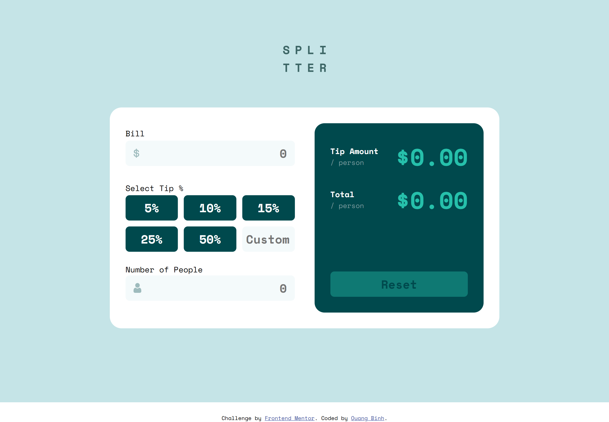

# Frontend Mentor - Tip calculator app solution

This is a solution to the [Tip calculator app challenge on Frontend Mentor](https://www.frontendmentor.io/challenges/tip-calculator-app-ugJNGbJUX). Frontend Mentor challenges help you improve your coding skills by building realistic projects.

## Table of contents

- [Overview](#overview)
  - [The challenge](#the-challenge)
  - [Screenshot](#screenshot)
  - [Links](#links)
- [My process](#my-process)
  - [Built with](#built-with)
  - [What I learned](#what-i-learned)
  - [Continued development](#continued-development)
  - [Useful resources](#useful-resources)
  - [AI Collaboration](#ai-collaboration)
- [Author](#author)
- [Acknowledgments](#acknowledgments)

## Overview

### The challenge

Users should be able to:

- View the optimal layout for the app depending on their device's screen size
- See hover states for all interactive elements on the page
- Calculate the correct tip and total cost of the bill per person

### Screenshot

### Links

- Solution URL: [Solution URL here](https://github.com/nqbinh98/tip-calculator-app)
- Live Site URL: [Live site URL here](https://nqbinh98.github.io/tip-calculator-app/)

## My process

### Built with

- Semantic HTML5 markup
- CSS custom properties
- Flexbox
- CSS Grid
- Mobile-first workflow
- Vanilla JavaScript

### What I learned
- I learned how to manipulate the DOM effectively to create a real-time calculator.
- I deepened my understanding of CSS flexbox and grid to build a responsive layout.
- I practiced managing complex state interactions between buttons and input fields.
- I discovered the power of :focus-within and learned how to handle events like blur to improve user experience.

### Continued development
- In future projects, I want to explore using a framework like React or Vue to manage state more cleanly.
- I aim to improve my accessibility (a11y) implementation in future challenges.
- I'd like to refine my CSS architecture and move towards BEM or CSS modules.

### Useful resources
- MDN Web Docs
- CSS-Tricks
- Stack Overflow

### AI 
During this project, I collaborated with an AI assistant to refine my logic for the calculator and troubleshoot complex state management issues. It helped me understand the importance of separating UI logic from data processing.

## Author

- Website - [nqbinh98](https://github.com/nqbinh98)
- Frontend Mentor - [@nqbinh98](https://www.frontendmentor.io/profile/nqbinh98)

## Acknowledgments
Thanks to Frontend Mentor for providing these amazing challenges. I also want to acknowledge the help from the community and AI tools that assisted me during the development process.
